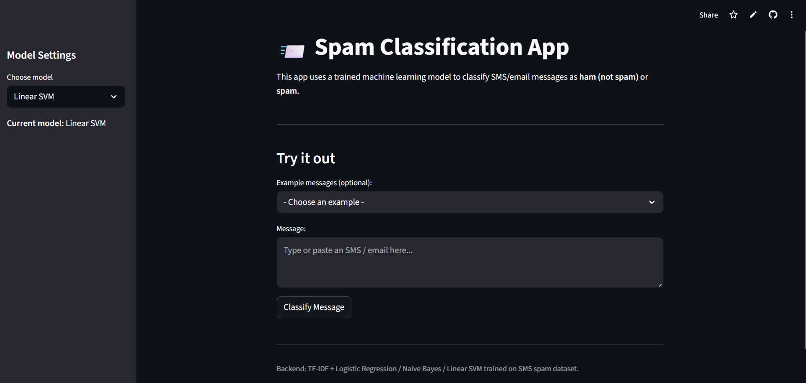
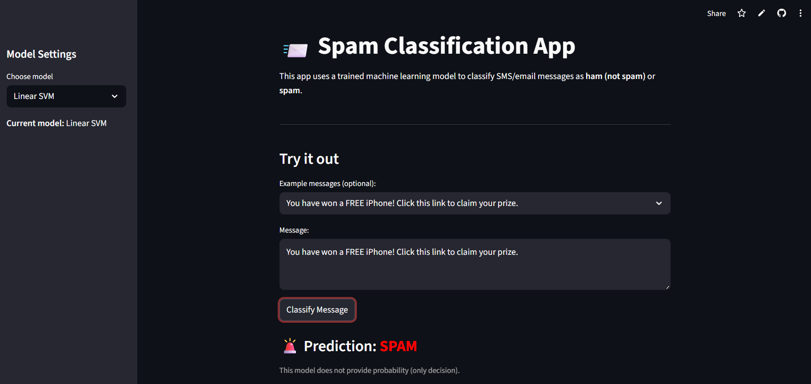
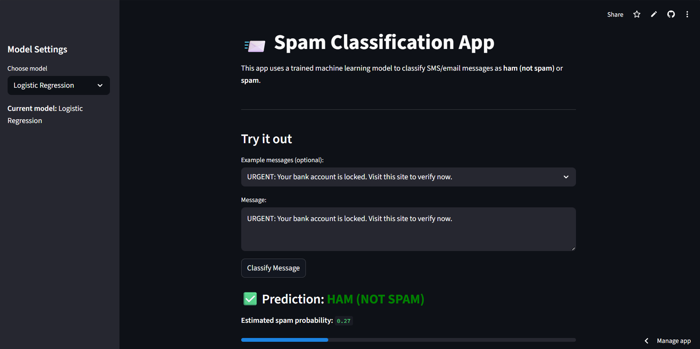

# 📩 SMS Spam Classification (Streamlit App)

A clean and lightweight machine learning web application that classifies SMS/Email messages as **Spam** or **Ham** using NLP (TF-IDF) and Scikit-learn models.  
Built with **Streamlit**, trained locally, and deployed on **Streamlit Cloud**.

🔗 **Live App:**  
👉 https://spam-classification-akira.streamlit.app/

---

## 📦 Dataset

This project uses the **Spam Email Classification Dataset** from Kaggle:

**Dataset Source:**  
🔗 https://www.kaggle.com/datasets/ashfakyeafi/spam-email-classification

**Author:** Ashfak Yeafi  
The dataset contains 5,572 labeled messages (Ham/Spam) suitable for binary text classification.

---

## 🚀 Project Overview

This project demonstrates a complete end-to-end workflow for building and deploying a spam classifier:

### ✔ Data Pipeline
- Load & clean Kaggle spam dataset  
- Normalize label & text columns  
- Remove unwanted values  
- Split into train/test sets  

---

## 🤖 Models Used

All models use a **TF-IDF vectorizer + classifier** architecture:

| Model                   | Description                             |
| ----------------------- | --------------------------------------- |
| **Logistic Regression** | Strong baseline for classification       |
| **Naive Bayes**         | Fast and effective for text data         |
| **Linear SVM**          | Best performer for sparse text features  |

---

## 📊 Model Performance

80/20 train-test split results:

| Model                | Accuracy | F1-Score |
|----------------------|----------|----------|
| Logistic Regression  | ~0.96    | ~0.92    |
| Naive Bayes          | ~0.97    | ~0.95    |
| **Linear SVM**       | **~0.98**| **~0.97**|

> ⭐ **Linear SVM consistently delivers the best overall performance.**

---

## 🖥️ Streamlit Interface Screenshots

Below are sample images of the app interface:

### 🔹 Example 1 

### 🔹 Example 2 

### 🔹 Example 3  

